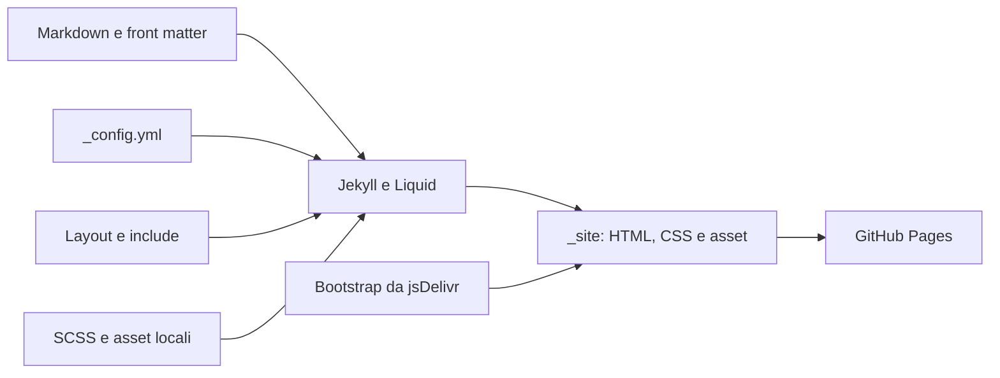

# carlofinocchiaro.github.io

Sito personale statico in italiano, generato con Jekyll e pubblicabile su GitHub Pages.

## Architettura



Il progetto non contiene backend, API, database o stato runtime. Bootstrap e caricato solo dal post fotografico; font, immagini e icone sono locali.

## Requisiti

- Ruby 3.4.7
- Bundler 2.7.x

## Sviluppo

```powershell
bundle install
bundle exec jekyll serve
```

Il sito locale e disponibile su `http://127.0.0.1:4000`.

## Verifica

```powershell
bundle exec jekyll build --trace
ruby script/validate_site.rb
```

La CI esegue entrambi i comandi su ogni push e pull request. La review tecnica completa e in `docs/enterprise-review.md`.